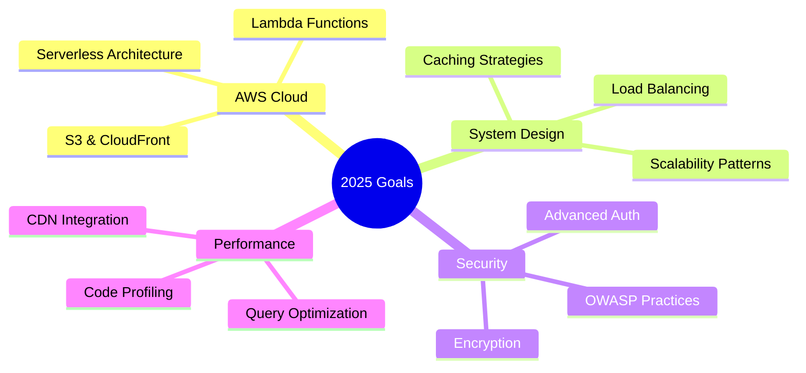

<div align="center">
  
</div>

<div align="center">
  <a href="https://git.io/typing-svg">
    
  </a>
</div>

<div align="center">
  <a href="https://anas-portfolio-rho.vercel.app/">
    
  </a>
  <a href="https://www.linkedin.com/in/muhammad-anas-nawaz-9730a8287/">
    
  </a>
  <a href="mailto:anakxofficial@gmail.com">
    
  </a>
  <a href="https://github.com/manas8938">
    
  </a>
</div>

<br/>


##  About Me

```typescript
const anas: Developer = {
    name: "Muhammad Anas Nawaz",
    role: "Full Stack Developer | Software Engineer",
    location: "Peshawar, Pakistan 🇵🇰",
    
    expertise: [
        "Multi-Tenant SaaS Architecture",
        "RESTful API Design",
        "Microservices",
        "Clean Architecture"
    ],
    
    currentFocus: [
        "AWS Cloud Services",
        "Serverless Architecture",
        "System Design Patterns",
        "Performance Optimization"
    ],
    
    achievements: {
        dailyUsers: "1,000+",
        apiEndpoints: "90+",
        responseTimeImprovement: "45%",
        deploymentTimeReduction: "2hrs → 15min"
    },
    
    funFact: "I turn caffeine into production-ready code ☕→💻"
};
```


##  Tech Stack

<div align="center">

### 🎨 Frontend Development


### ⚙️ Backend Development


### 🗄️ Database & Infrastructure


</div>

### 🏗️ Architecture & Practices
<div align="center">
  
| Category | Technologies |
|:--------:|:-------------|
| 🏢 **Architecture** | Multi-Tenant SaaS • Microservices • Clean Architecture |
| 🔐 **Security** | JWT Authentication • OAuth2 • RBAC • Bcrypt |
| 📡 **APIs** | RESTful Design • Swagger Documentation • Validation |
| ⚡ **Performance** | Redis Caching • BullMQ Queues • Background Jobs |
| 🔄 **DevOps** | Docker • CI/CD Pipelines • Git Workflows |
| 📱 **State Management** | Context API • Provider Pattern |

</div>


##  Featured Projects

<div align="center">

<a href="#">
  
</a>
<a href="#">
  
</a>

</div>

### 🏆 Multi-Tenant SaaS Platform
<table>
<tr>
<td width="60%">

**Enterprise-grade multi-tenant backend architecture**

- 🔒 Complete data isolation with tenant-specific schemas
- 💳 Three-tier subscription system (Free/Pro/Enterprise)
- 📊 Redis-backed BullMQ for audit logging & notifications
- 👥 Comprehensive RBAC (Owner/Admin/Member)
- 📝 40+ Swagger documented API endpoints

</td>
<td width="40%">

```
Tech Stack:
├── NestJS
├── PostgreSQL + Prisma
├── Redis + BullMQ
├── Docker
├── JWT + RBAC
└── Swagger
```

</td>
</tr>
</table>

### 🛒 Calvio Mart - E-Commerce Platform
<table>
<tr>
<td width="60%">

**Full-featured e-commerce solution serving 1,000+ daily users**

- 🛍️ 50+ RESTful API endpoints with Swagger docs
- 🔐 Secure admin panel with RBAC & JWT authentication
- 🎨 30+ reusable React components with Tailwind CSS
- 📧 OTP verification & WhatsApp order confirmations
- 💳 Payment gateway integration

</td>
<td width="40%">

```
Tech Stack:
├── React.js
├── NestJS
├── PostgreSQL + TypeORM
├── Docker
├── Tailwind CSS
└── Swagger
```

</td>
</tr>
</table>

### 🚗 Movr App - Cross-Platform Mobile App
<table>
<tr>
<td width="60%">

**Clean architecture mobile application**

- 📱 Cross-platform Flutter app with Provider
- 🗄️ Normalized MySQL database with optimized queries
- 🔐 Secure RESTful APIs with JWT validation
- 📍 Real-time location tracking
- 📚 Complete Swagger documentation

</td>
<td width="40%">

```
Tech Stack:
├── Flutter + Provider
├── NestJS
├── MySQL + TypeORM
├── Docker
├── Firebase
└── JWT
```

</td>
</tr>
</table>

### 🍜 Kim Long Restaurant Website
<table>
<tr>
<td width="60%">

**Full-stack restaurant management system**

- 🍽️ Dynamic menu browsing with responsive design
- 🗺️ Google Maps integration for location
- 👥 Role-based access control for staff
- 📧 Contact form with email integration
- ⚡ Built with Vite for optimal performance

</td>
<td width="40%">

```
Tech Stack:
├── React + Vite
├── Tailwind CSS
├── Node.js Backend
├── Email Integration
└── Google Maps API
```

</td>
</tr>
</table>


##  GitHub Analytics

<div align="center">
  
  
</div>

<div align="center">
  
</div>

<div align="center">
  
</div>


## 🎓 Education & Certifications

<div align="center">

| 🎓 Education | 📜 Certifications |
|:-------------|:------------------|
| **BS Software Engineering** | **SQL & Relational Databases 101** - IBM (Jun 2025) |
| CECOS University, Peshawar | **AWS Academy Cloud Foundations** - AWS (Feb 2024) |
| Oct 2021 - Oct 2025 | **Mobile App Development with Flutter** - Alison (Mar 2024) |
| | **MySQL & Statistics for Data Analysis** - Alison (Apr 2024) |

</div>


## 📚 Currently Learning

<div align="center">
  


</div>


## 📫 Let's Connect

<div align="center">

| 📍 Location | 📧 Email | 📱 Phone |
|:-----------:|:--------:|:--------:|
| Peshawar, Pakistan | anakxofficial@gmail.com | +92 302 9125349 |

<br/>

<a href="https://anas-portfolio-rho.vercel.app/">
  
</a>
<a href="https://www.linkedin.com/in/muhammad-anas-nawaz-9730a8287/">
  
</a>
<a href="mailto:anakxofficial@gmail.com">
  
</a>

</div>


<div align="center">
  
</div>

<div align="center">
  <br/>
  
  <br/><br/>
  <sub>💼 <strong>Open to innovative projects and remote opportunities</strong> | Available for freelance collaborations</sub>
  <br/><br/>
  
</div>


